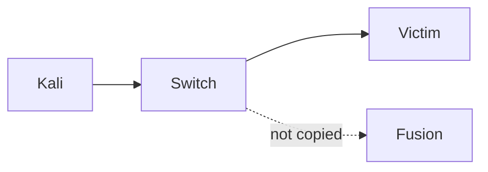
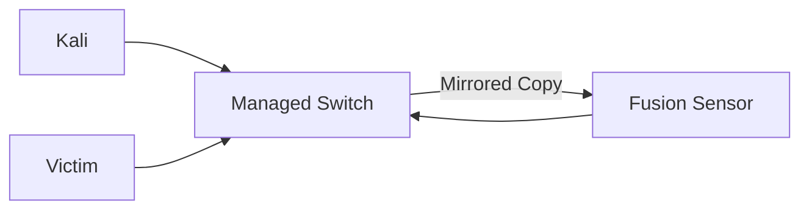
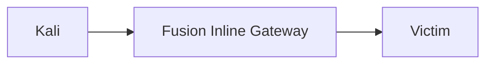
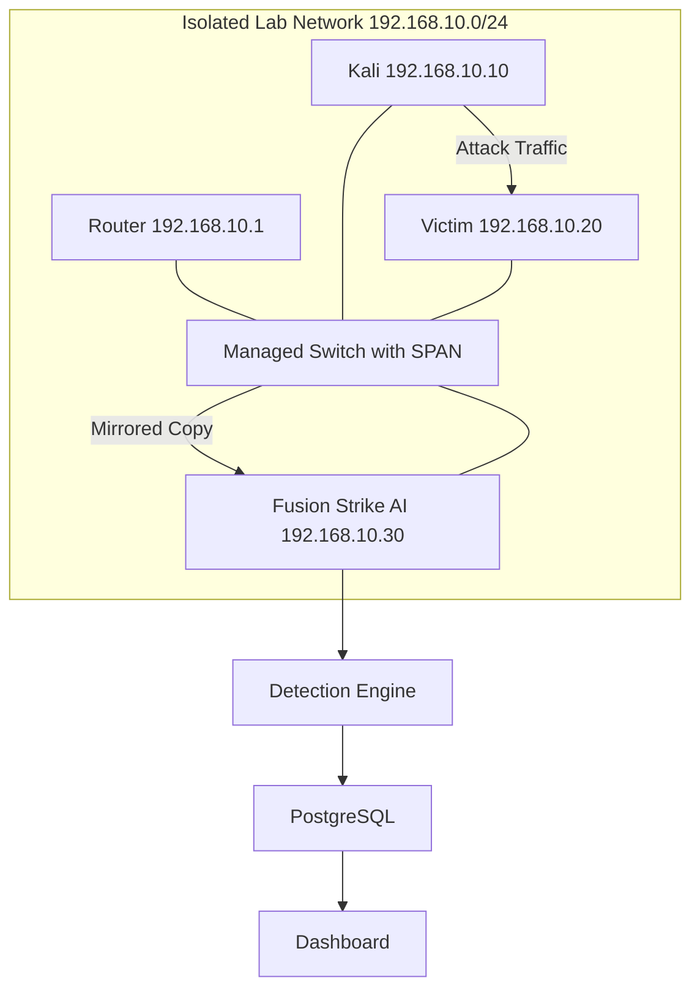
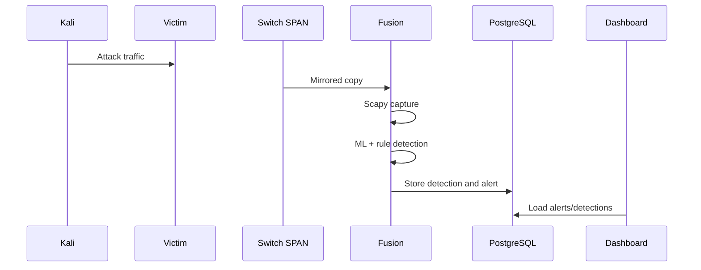
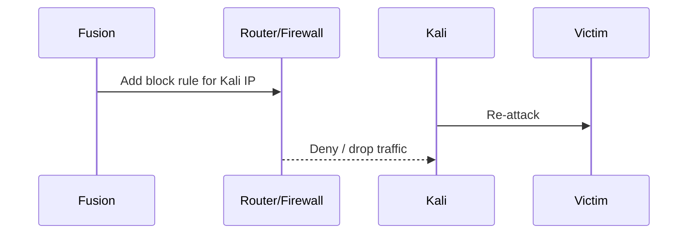
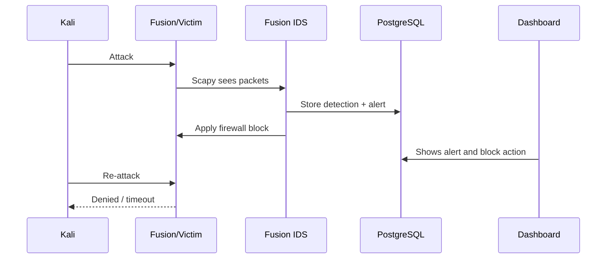

# Fusion Strike AI - Network Monitoring Architecture Review

## الهدف

هذا الملف يشرح Fusion Strike AI من منظور مراقبة الشبكة، وهل النظام الحالي يعمل كـ IDS/IPS على مستوى الشبكة بالكامل أم فقط على الجهاز الذي يعمل عليه.

السيناريو المطلوب:

- Router / Switch واحد
- جهاز Fusion Strike AI
- جهاز Kali attacker
- جهاز Victim أو أكثر
- كل الأجهزة على نفس الشبكة المعملية isolated lab network

---

## 1. هل LIVE Mode يراقب الشبكة بالكامل؟

الإجابة المختصرة: لا، ليس تلقائيا.

الوضع الحالي في `unified_agent.py` يستخدم Scapy بهذا الشكل:

```python
sniff(filter="ip", prn=_on_pkt, store=False)
```

هذا يعني أن Fusion Strike AI يلتقط فقط الترافيك الذي يصل فعليا إلى كارت الشبكة الخاص بجهاز Fusion.

في شبكة LAN عادية تستخدم Switch، هذا غالبا يعني:

- الترافيك الداخل إلى جهاز Fusion.
- الترافيك الخارج من جهاز Fusion.
- Broadcast / Multicast traffic مثل ARP.
- بعض ترافيك الشبكة العام.

لكنه لا يرى عادة الترافيك المباشر بين Kali و Victim إذا لم يكن Fusion في مسار الترافيك.

---

## 2. هل Scapy Sniffing يرى كل ترافيك LAN؟

في الوضع الحالي: لا.

Scapy يرى ما يصل إلى network interface فقط.

مثال:

```text
Kali  --->  Victim
```

لو Fusion جهاز ثالث على نفس السويتش، والسويتش عادي بدون port mirroring، فالـ traffic من Kali إلى Victim لن يصل إلى Fusion.

حتى لو فعلت promiscuous mode، هذا لا يجبر السويتش على إرسال ترافيك الأجهزة الأخرى إلى Fusion.

---

## 3. لو Kali هاجم Victim، هل Fusion سيكتشف الهجوم؟

في أغلب الحالات: لا.

Fusion سيكتشف الهجوم فقط إذا كان واحد من الآتي صحيح:

1. Fusion مثبت على جهاز Victim نفسه.
2. Fusion متصل بمنفذ SPAN / Port Mirroring في Managed Switch.
3. Fusion متصل بـ Network TAP.
4. Fusion يعمل كـ Gateway / Inline IPS بين Kali و Victim.
5. الترافيك بين Kali و Victim يمر فعلا عبر جهاز Fusion.

---

## 4. لماذا لا يرى Fusion كل شيء؟

### Switch Behavior

السويتش يتعلم MAC address لكل جهاز.

لو Kali يرسل packet إلى Victim، السويتش يرسلها فقط إلى منفذ Victim، وليس إلى كل المنافذ.



### Router Behavior

الراوتر يرى الترافيك الذي يعبر بين شبكات مختلفة.

لو Kali و Victim على نفس subnet، مثلا:

```text
Kali:   192.168.10.10
Victim: 192.168.10.20
```

فالترافيك بينهما غالبا لا يمر على الراوتر بعد عملية ARP. السويتش يرسله مباشرة بين الجهازين.

### Promiscuous Mode Limitation

Promiscuous mode يعني:

> كارت الشبكة يقبل أي packet تصل إليه حتى لو ليست موجهة له.

لكن المشكلة أن السويتش لا يرسل له packet الخاصة بـ Kali و Victim من الأساس.

لذلك promiscuous mode وحده لا يكفي في switched LAN.

### Wi-Fi Limitation

على Wi-Fi الوضع أصعب:

- managed mode يرى غالبا ترافيك الجهاز نفسه.
- monitor mode قد يرى أكثر، لكنه يعتمد على driver وكارت الشبكة.
- التشفير والقناة اللاسلكية قد يمنعان رؤية البيانات بشكل مفيد.
- على Windows/Npcap الموضوع أقل استقرارا.

لذلك Wi-Fi ليس أفضل خيار لعرض تخرج موثوق.

---

## 5. ما المطلوب ليصبح Fusion IDS/IPS حقيقي على مستوى الشبكة؟

### أولا: Visibility حقيقية

لازم Fusion يرى الترافيك.

يمكن ذلك عن طريق:

- SPAN / Port Mirroring
- Network TAP
- Inline Gateway
- تثبيت Agent على كل Victim

### ثانيا: Interface Selection

يفضل تعديل `unified_agent.py` ليقبل اسم كارت الشبكة:

```text
python unified_agent.py --mode live --iface Ethernet
```

ثم يستخدم:

```python
sniff(
    iface=args.iface,
    filter="ip",
    prn=_on_pkt,
    store=False,
    promisc=True,
)
```

### ثالثا: Enforcement حقيقي

حاليا `host_actions.py` يسجل حالة block في قاعدة البيانات والداشبورد، لكنه لا يمنع الترافيك فعليا على الشبكة.

لـ IPS حقيقي، يجب تنفيذ block في نقطة تتحكم في مرور الترافيك:

- Victim firewall
- Router firewall
- Fusion كـ Gateway
- Switch ACL
- Endpoint agent على كل جهاز

### رابعا: توضيح نوع المنع في الواجهة

يفضل أن يوضح النظام هل الـ block:

```text
Database-only
Local firewall
Router firewall
Inline gateway firewall
Simulation
```

هذا مهم جدا في المناقشة حتى لا يظهر أن النظام يدعي منع حقيقي بينما هو يسجل فقط.

---

## 6. مقارنة Deployment Models

| Model | Visibility | Detection | Prevention | Hardware | Difficulty |
|---|---|---|---|---|---|
| A) Local Host IDS | يرى ترافيك الجهاز المثبت عليه فقط | ممتاز لحماية Victim واحد | يمكنه المنع على نفس الجهاز بالـ firewall | لا يحتاج سويتش خاص | سهل |
| B) SPAN / Port Mirroring IDS | يرى الترافيك المنسوخ من السويتش | ممتاز كمراقبة شبكة | لا يمنع وحده، يحتاج router/firewall integration | Managed Switch | متوسط وسهل للعرض |
| C) Network TAP IDS | رؤية قوية جدا للترافيك | ممتاز ودقيق | لا يمنع وحده | TAP device + NIC إضافي | متوسط إلى صعب |
| D) Gateway / Inline IPS | يرى كل ما يمر بين الشبكات | ممتاز | يمنع فعليا لأنه في مسار الترافيك | جهاز Fusion باثنين NIC أو راوتر/فايروول | الأصعب والأكثر واقعية |

---

## A) Local Host IDS

### الفكرة

تثبت Fusion على جهاز Victim نفسه.

### Visibility

يرى الترافيك الداخل والخارج من Victim.

### Detection

يستطيع اكتشاف هجمات Kali على نفس الجهاز.

### Prevention

يمكنه منع Kali باستخدام firewall rule محلي على Victim.

### Hardware

لا يحتاج Managed Switch.

### Difficulty

سهل جدا ومناسب كـ demo سريع.

### العيب

ليس Network-wide IDS. هو Host IDS فقط.

---

## B) SPAN / Port Mirroring IDS

### الفكرة

Managed Switch يرسل نسخة من الترافيك إلى Fusion.



### Visibility

يرى Fusion الترافيك الذي يتم عمل mirror له.

### Detection

ممتاز لاكتشاف:

- Port scan
- DDoS
- Brute force
- Malware-like behavior
- Suspicious flows

### Prevention

SPAN وحده لا يمنع. هو مراقبة فقط.

للمنع تحتاج:

- Router firewall
- Victim firewall
- Switch ACL
- Endpoint agent

### Hardware

Managed Switch يدعم Port Mirroring.

### Difficulty

أفضل اختيار لعرض التخرج: واقعي، واضح، وآمن.

---

## C) Network TAP IDS

### الفكرة

جهاز TAP يوضع بين نقطتين في الشبكة وينسخ الترافيك إلى Fusion.

### Visibility

ممتازة جدا لأنه يأخذ نسخة مباشرة من link.

### Detection

قوية ودقيقة.

### Prevention

لا يمنع وحده لأنه passive.

### Hardware

Network TAP + كارت شبكة إضافي.

### Difficulty

أصعب وأغلى من SPAN.

---

## D) Gateway / Inline IPS

### الفكرة

Fusion يكون في مسار الترافيك نفسه.



### Visibility

يرى كل الترافيك الذي يعبر بين Kali و Victim.

### Detection

ممتازة لأن كل الترافيك يمر به.

### Prevention

ممتازة لأنه يستطيع drop packets قبل وصولها إلى Victim.

### Hardware

جهاز Fusion يحتاج غالبا:

- 2 network interfaces
- أو يكون Router/Gateway نفسه

### Difficulty

الأصعب لكنه أقرب إلى IPS حقيقي.

---

## 7. أفضل إعداد لعرض التخرج

أفضل إعداد عملي وواقعي:

### SPAN / Port Mirroring + Block على Router أو Victim Firewall

لأنه يثبت أنك تفهم الفرق بين:

- الرؤية Detection Visibility
- المنع Prevention Enforcement

---

## 8. تصميم Lab كامل

### IP Addresses

```text
Network:          192.168.10.0/24
Router/Gateway:   192.168.10.1
Kali Attacker:    192.168.10.10
Victim Machine:   192.168.10.20
Fusion Strike AI: 192.168.10.30
```

### Architecture



### Traffic Flow

```text
Kali sends attack traffic to Victim
Switch forwards real traffic to Victim
Switch sends mirrored copy to Fusion
Fusion analyzes copy
Fusion creates detection and alert
Dashboard displays incident
```

### Detection Flow



### Prevention Flow



---

## 9. كيف يجب أن يتم Block بعد Detection؟

لكي يكون IPS حقيقي، يجب أن يتم block في مكان يمر منه الترافيك.

### Option 1: Block على Victim

لو Fusion مثبت على Victim:

```text
Block Kali IP on Victim firewall
```

مثال Windows:

```bat
netsh advfirewall firewall add rule name="FusionBlock_192.168.10.10" dir=in action=block remoteip=192.168.10.10
```

مثال Linux:

```bash
sudo iptables -A INPUT -s 192.168.10.10 -j DROP
```

### Option 2: Block على Gateway

لو Fusion يتحكم في Router/Gateway:

```bash
sudo iptables -A FORWARD -s 192.168.10.10 -d 192.168.10.20 -j DROP
```

### Option 3: Fusion Inline

لو Fusion هو Gateway:

```bash
sudo sysctl -w net.ipv4.ip_forward=1
sudo iptables -A FORWARD -s 192.168.10.10 -j DROP
```

### Option 4: Database-only Block

هذا هو الأسهل لكنه ليس IPS حقيقي.

هو يظهر في Dashboard فقط:

```text
Attacker marked as blocked
Alert created
Action logged
```

لكن الترافيك سيستمر إذا لم توجد firewall rule حقيقية.

---

## 10. Demo Scenario باستخدام المشروع الحالي

أسهل demo حقيقي بالمشروع الحالي:

```text
Fusion installed on Victim machine
Kali attacks Fusion/Victim
Fusion detects attack
Fusion creates alert
Fusion blocks Kali on local firewall
Kali attacks again
Attack is denied
```

### Flow



### Demo Steps

1. Start Fusion:

```bat
start_all.bat
```

2. Open dashboard:

```text
http://localhost:4173
```

3. From Kali, run attack examples:

```bash
nmap -sS 192.168.10.30
```

or:

```bash
hping3 -S --flood -p 80 192.168.10.30
```

or SSH brute-force in a controlled lab:

```bash
hydra -l admin -P passwords.txt ssh://192.168.10.30
```

4. Show in Dashboard:

- Live Monitoring
- Alerts
- Suspicious Queue
- Actions
- Blocked Hosts
- Activity Timeline

5. Apply or show block action.

6. Run attack again from Kali.

7. Expected result:

```text
Connection timeout
Filtered port
No response
Denied traffic
```

---

## Important Truth For Viva

Use this sentence:

> Fusion Strike AI can analyze any traffic that reaches its sensor interface. To become network-wide, it must be connected through SPAN/TAP or placed inline. Promiscuous mode alone is not enough on a switched LAN.

---

## Final Recommendation

For the graduation project, present Fusion Strike AI as:

```text
AI-assisted IDS/IPS platform
with multiple deployment options
```

Then explain honestly:

- Current LIVE mode is host/interface visibility.
- For network-wide detection, use SPAN or TAP.
- For true prevention, enforce blocks at victim firewall, router firewall, or inline gateway.
- Dashboard block state alone is not enough for real IPS prevention.

This explanation is technically correct and will make the project stronger in discussion.
