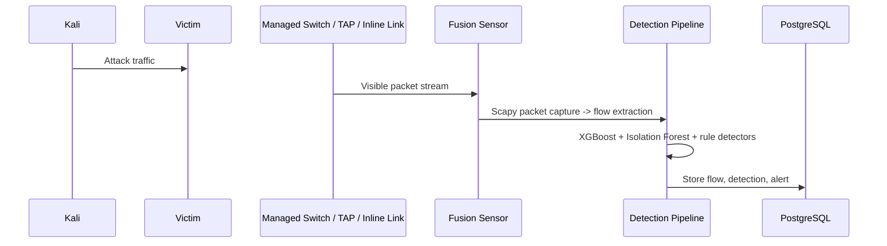
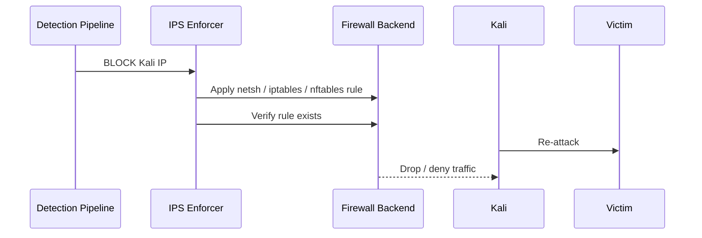
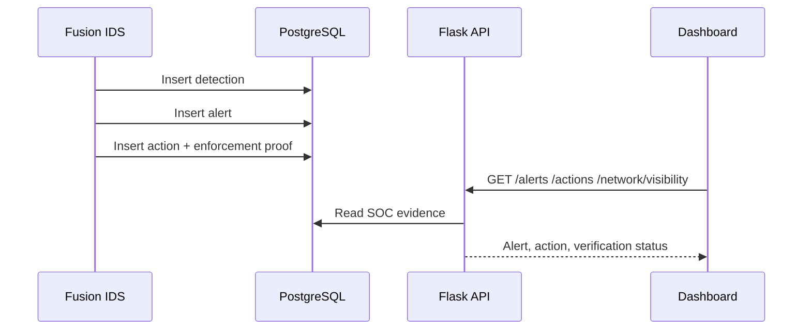
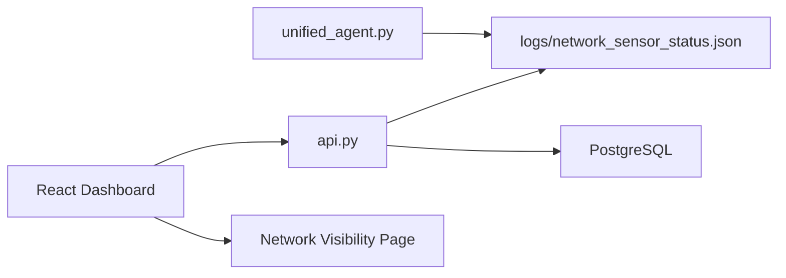

# Fusion Strike AI - Network-Wide IDS/IPS Implementation Guide

## What Changed

Fusion Strike AI now has explicit deployment profiles and enforcement profiles.

Sensor profiles:

```text
SENSOR_MODE=host
SENSOR_MODE=span
SENSOR_MODE=tap
SENSOR_MODE=inline
```

IPS profiles:

```text
IPS_MODE=database
IPS_MODE=local_firewall
IPS_MODE=gateway_firewall
IPS_MODE=inline
```

Live mode now supports explicit capture interface selection:

```bat
.\.venv\Scripts\python.exe unified_agent.py --mode live --iface Ethernet --sensor-mode span
```

or through `.env`:

```text
SENSOR_MODE=span
CAPTURE_INTERFACE=Ethernet
PROMISCUOUS_MODE=true
IPS_MODE=gateway_firewall
FIREWALL_BACKEND=auto
```

The dashboard now includes a **Network Visibility** page showing:

- capture interface
- sensor mode
- promiscuous mode
- packets captured
- flows analyzed
- visibility type
- IPS mode
- firewall backend
- enforcement method
- verification status
- whether the block was database-only or a real firewall block

---

## Important Limitation

Fusion can only analyze traffic that reaches its capture interface.

Promiscuous mode is useful, but it does not defeat switch forwarding behavior. On a normal switched LAN, Kali-to-Victim traffic is not sent to Fusion unless Fusion is connected through SPAN, TAP, or inline gateway placement.

---

## Recommended Graduation Lab

```text
Network:          192.168.10.0/24
Router:           192.168.10.1
Fusion Strike AI: 192.168.10.30
Kali Linux:       192.168.10.10
Victim Machine:   192.168.10.20
```

Best defense setup:

```text
Detection: SPAN / Port Mirroring
Prevention: Gateway firewall or local victim firewall
```

Most impressive setup:

```text
Detection + Prevention: Fusion Inline Gateway IPS
```

---

## Detection Flow



## Prevention Flow



## Alert Flow



## Dashboard Flow



---

## SPAN / Port Mirroring Setup

Use a managed switch.

### Physical Cabling

```text
Switch Port 1: Router
Switch Port 2: Kali
Switch Port 3: Victim
Switch Port 4: Fusion Strike AI
```

### Switch Configuration Concept

Configure a mirror session:

```text
Source ports:      Kali port and Victim port
Destination port:  Fusion port
Direction:         both ingress and egress
```

### Example Cisco-Style Configuration

```text
monitor session 1 source interface fa0/2 both
monitor session 1 source interface fa0/3 both
monitor session 1 destination interface fa0/4
```

### Example TP-Link / Netgear Web UI Steps

1. Open switch management page.
2. Go to **Port Mirroring** or **SPAN**.
3. Enable mirroring.
4. Set mirror destination port to Fusion port.
5. Add Kali port and Victim port as source ports.
6. Select both RX and TX if available.
7. Save configuration.

### Fusion Command

```bat
.\.venv\Scripts\python.exe unified_agent.py --mode live --iface Ethernet --sensor-mode span
```

Expected dashboard truth:

```text
Sensor Mode: SPAN
Visibility Type: Mirrored Traffic
Network-wide Capable: Yes
Inline Prevention Capable: No
```

---

## TAP Mode Setup

Use a physical or virtual network TAP that copies traffic from a link to Fusion.

```text
Kali/Victim link or uplink -> TAP -> mirrored output -> Fusion sensor NIC
```

Fusion command:

```bat
.\.venv\Scripts\python.exe unified_agent.py --mode live --iface Ethernet --sensor-mode tap
```

Expected dashboard truth:

```text
Sensor Mode: TAP
Visibility Type: Mirrored Traffic
Network-wide Capable: Yes
Inline Prevention Capable: No
```

TAP mode is excellent for passive detection, but prevention still needs a firewall/router/inline control point.

---

## Inline Gateway IPS Setup

This is the strongest IPS demonstration.

Fusion needs two network interfaces.

```text
Fusion NIC 1: attacker-side
Fusion NIC 2: victim-side
```

### IP Scheme

```text
Kali network:   10.10.10.0/24
Victim network: 10.10.20.0/24

Fusion NIC 1: 10.10.10.1
Fusion NIC 2: 10.10.20.1
Kali:         10.10.10.10 gateway 10.10.10.1
Victim:       10.10.20.20 gateway 10.10.20.1
```

### Linux Forwarding

On Fusion Linux:

```bash
sudo sysctl -w net.ipv4.ip_forward=1
```

Make persistent:

```bash
echo "net.ipv4.ip_forward=1" | sudo tee /etc/sysctl.d/99-fusion-inline.conf
sudo sysctl --system
```

### Optional NAT

Only needed if the victim-side network needs Internet through Fusion:

```bash
sudo iptables -t nat -A POSTROUTING -o <internet_nic> -j MASQUERADE
```

### Fusion Environment

```text
SENSOR_MODE=inline
IPS_MODE=inline
FIREWALL_BACKEND=iptables
CAPTURE_INTERFACE=<fusion_forwarding_interface>
PROMISCUOUS_MODE=true
```

### Fusion Command

```bash
python unified_agent.py --mode live --iface <fusion_forwarding_interface> --sensor-mode inline
```

Expected dashboard truth:

```text
Sensor Mode: INLINE
Visibility Type: Full Inline Traffic
Inline Prevention Capable: Yes
IPS Mode: INLINE
Real Prevention: Capable
```

---

## Real IPS Enforcement

Fusion supports these firewall backends:

```text
Windows Firewall
Linux iptables
Linux nftables
```

Backend selection:

```text
FIREWALL_BACKEND=auto
FIREWALL_BACKEND=windows
FIREWALL_BACKEND=iptables
FIREWALL_BACKEND=nftables
```

### IPS_MODE Meanings

```text
database
```

Records block state in PostgreSQL and dashboard only. No real traffic is stopped.

```text
local_firewall
```

Blocks attacker traffic on the Fusion machine local firewall. Best when Fusion is also the victim.

```text
gateway_firewall
```

Applies forwarding firewall rules. Use when Fusion controls a gateway/firewall.

```text
inline
```

Applies forwarding firewall rules while Fusion is physically/logically in the path.

---

## Complete Demo Scenario

### 1. Start Fusion

SPAN demo:

```bat
set SENSOR_MODE=span
set IPS_MODE=gateway_firewall
set FIREWALL_BACKEND=auto
start_all.bat
```

Inline demo:

```bash
export SENSOR_MODE=inline
export IPS_MODE=inline
export FIREWALL_BACKEND=iptables
python api.py
python unified_agent.py --mode live --iface eth1 --sensor-mode inline
```

### 2. Open Dashboard

```text
http://localhost:4173
```

Open:

```text
Network Visibility
```

Point to:

- Sensor Mode
- Capture Interface
- Packets Captured
- Flows Analyzed
- IPS Mode
- Firewall Backend
- Real Prevention

### 3. Attack From Kali

Port scan:

```bash
nmap -sS 192.168.10.20
```

DDoS-like lab traffic:

```bash
sudo hping3 -S --flood -p 80 192.168.10.20
```

SSH brute-force in a controlled lab:

```bash
hydra -l admin -P passwords.txt ssh://192.168.10.20
```

### 4. Fusion Detects

Show:

- Live Monitoring
- Alerts
- Suspicious Queue

### 5. Auto Response

Auto-response calls:

```text
execute_host_action(action="BLOCK", target=<Kali IP>)
```

Then:

```text
ips_enforcer.py
```

applies the firewall rule.

### 6. Dashboard Update

Open:

```text
Actions
Network Visibility
```

Point to:

- Enforcement Method
- Verification Status
- Real Block Applied
- Database Only
- Inline Block
- Gateway Block

### 7. Re-Attack

Run the same Kali attack again.

Expected:

```text
filtered
timeout
no response
connection denied
```

Dashboard should show:

```text
Verification Status: verified
Real Block Applied: YES
Database Only: NO
```

---

## Which Model Should You Defend?

### Easiest

```text
Local Host IDS + local firewall
```

Good for proving detection and immediate denial, but not network-wide.

### Most Realistic

```text
SPAN IDS + router/gateway enforcement
```

Best balance for a graduation project. It shows real SOC architecture and honest separation between monitoring and blocking.

### Most Impressive

```text
Inline Gateway IPS
```

Best technical defense. Fusion sees traffic and blocks it because it is in the path. Harder to configure but strongest academically.

---

## Defense Statement

Use this:

> Fusion Strike AI now supports multiple deployment profiles. In host mode it is honest about host-only visibility. In SPAN and TAP modes it proves mirrored network visibility. In inline mode it can operate as a real IPS because traffic passes through Fusion and firewall rules are verified after enforcement.

